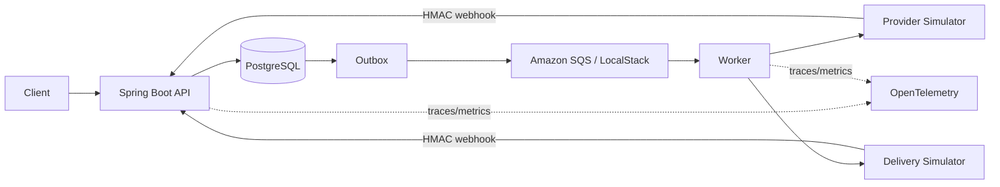

# FulfillmentHub Java

Java/Spring Boot implementation of a transactional fulfillment system focused on consistency, messaging, resilience, and failure recovery. It addresses the same business problem as the .NET implementation while using idiomatic choices for the Java ecosystem.

## Failure guarantees

- Order, stock reservation, idempotency association, and outbox messages commit atomically.
- Lost payment or delivery responses are resumed with the original provider idempotency key.
- Provider snapshots pass through one transition policy, preventing stale transitions such as `Paid → Pending`.
- SQS consumers and webhook inbox records use owner-fenced claims and recover expired leases.
- Outbox delivery is at-least-once. The project does not claim remote exactly-once processing.
- Permanent provider rejection becomes an explicit terminal state and triggers durable compensation.

PostgreSQL integration tests cover unauthorized cancellation, lost provider responses, duplicate delivery, out-of-order state, concurrent webhook claims, and the HTTP idempotency crash window.

## Arquitetura



O domínio permanece independente do framework. `runtime` concentra JPA, transações, inbox/outbox, SQS e integrações. `api`, `worker` e `provider-simulator` são processos executáveis separados.

## Stack

- Java 25, Maven 3.9.16 e Spring Boot 4.1.1
- Spring MVC, Security Resource Server, JPA/Hibernate e Flyway
- PostgreSQL 17.6
- AWS SDK v2 e SQS; LocalStack no ambiente local
- Terraform para um ambiente AWS descartável com EC2, S3 privado, IAM Role, SQS/DLQ, Parameter Store e HTTPS
- Resilience4j para retry seletivo e circuit breaker dos provedores
- Micrometer, Prometheus e OpenTelemetry
- JUnit Jupiter 5.14.4
- Docker Compose e manifests Kubernetes

## Executar localmente

Pré-requisito: Docker Desktop ou Docker Engine com Compose.

```powershell
docker compose up -d --build --wait
```

Serviços publicados apenas em loopback:

- API: `http://127.0.0.1:8080`
- simulador: `http://127.0.0.1:8082`
- PostgreSQL: `127.0.0.1:55432`
- LocalStack: `127.0.0.1:4566`

Contas locais criadas pelo seed:

| Papel | E-mail | Senha local |
|---|---|---|
| Admin | `admin@fulfillment.local` | `LocalAdminPassword!` |
| Customer | `customer@fulfillment.local` | `LocalCustomerPassword!` |

Esses valores existem apenas para o ambiente local. Produção exige segredos externos.

## Build e testes

```powershell
./scripts/build.ps1
./scripts/integration-test.ps1
./scripts/e2e.ps1
```

O primeiro comando executa o build reproduzível na imagem Maven/Temurin fixada por digest. O segundo sobe PostgreSQL e LocalStack reais, aplica as migrations e executa testes de integração. H2 não é usado.

O E2E autentica um cliente, consulta catálogo, cria um pedido, comprova replay e mismatch idempotente e aguarda pagamento, webhook e entrega até `Delivered`.

## Contratos

A API expõe 17 operações sob `/api/v1`: autenticação e sessões, usuário administrativo, catálogo, criação/listagem/leitura/cancelamento de pedidos, webhooks e operação da outbox. Há ainda `/health/live` e `/health/ready`.

Pedidos exigem `Idempotency-Key`. O estoque, o pedido e a outbox são gravados no mesmo commit. O worker entrega eventos at-least-once, e consumers persistem a deduplicação antes de confirmar a mensagem. Webhooks autenticam `timestamp + '.' + bytes brutos` com HMAC-SHA256 e são armazenados antes do processamento.

## Segurança

- JWT HS256 valida algoritmo, issuer, audience, tempo, `sid` e sessão ativa no PostgreSQL.
- Refresh tokens usam rotação estrita e somente SHA-256 é persistido.
- Autorização é deny-by-default, com papéis Customer, Operator e Admin.
- Corpos têm limites globais e específicos para webhooks; respostas sensíveis usam `no-store`.
- Imagens executam como usuário não-root; manifests removem capabilities e bloqueiam privilege escalation.
- CI inclui Gitleaks e Trivy.

## Observability

Structured logs carry a correlation ID. Actuator publishes health and Prometheus metrics. Micrometer/OpenTelemetry exports traces through OTLP when a collector is configured. The outbox persists correlation and `traceparent`; complete cross-process trace continuation remains a documented limitation.

Para abrir localmente Grafana, Prometheus, Tempo e o collector OTLP:

```powershell
docker compose --profile observability up -d --build --wait
```

O Grafana fica em `http://127.0.0.1:3000`. O endpoint Prometheus da API exige autenticação administrativa.

## Documentação de engenharia

- [Mapeamento .NET → Java](docs/DOTNET_TO_JAVA.md)
- [Matriz de paridade](docs/PARITY_MATRIX.md)
- [Decisões arquiteturais Java](docs/JAVA_ARCHITECTURE_DECISIONS.md)
- [Engenharia reversa da fonte .NET](docs/REVERSE_ENGINEERING.md)

## Operação

Migrations e seed são etapas explícitas e idempotentes. A API só inicia depois dessas etapas no Compose. O worker provisiona filas e DLQs locais, processa outbox/webhooks e executa reconciliação. O endpoint de readiness depende do PostgreSQL, sem transformar indisponibilidade transitória do broker em remoção de todas as instâncias da API.

Local development simulates AWS services with LocalStack. On 2026-10-03, I deployed the complete stack to AWS in `us-east-1` and verified it through public HTTPS health checks and an end-to-end order that reached `Delivered`. Terraform provisions EC2, a private S3 artifact bucket, an instance IAM Role, SQS/DLQs, SSM Parameter Store and HTTPS without storing AWS access keys on the host. The current demonstration endpoint, evidence, cost controls and reproduction procedure are in [`docs/AWS_EC2_DEPLOYMENT.md`](docs/AWS_EC2_DEPLOYMENT.md).
