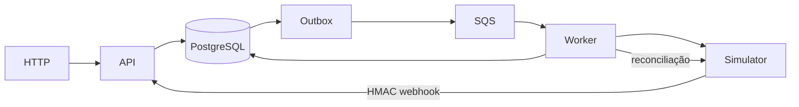

# Engenharia reversa — fulfillment-hub

Referência: checkout .NET no commit `dd2af04e71e624f0177bb500ee99b048d29e3a20`, inicialmente sem alterações. Inventário de arquivos versionados e SHA-256 em `SOURCE_INVENTORY.csv`. Este documento registra a análise inicial; não declara que o port ou seus gates estejam concluídos.

## Arquitetura observada

Monólito modular, PostgreSQL compartilhado, três processos: API, Worker e ProviderSimulator. Seis projetos de produção e quatro de testes. Módulos: identidade, catálogo, clientes, pedidos, pagamentos, entregas; infraestrutura de idempotência, inbox, outbox, mensageria e telemetria. O simulador é independente dos módulos do produto.

O estado do código prevalece sobre descrições históricas. ARCHITECTURE ainda menciona ausência de Kubernetes e E2E, mas ambos existem. PROJECT_STATE contém contagens históricas. A auditoria de 24/09 registra 284 testes, dos quais 279 passaram e 5 E2E foram ignorados na suíte padrão; os 5 E2E passaram separadamente em Compose e Minikube. Esses resultados são históricos, não uma execução nesta migração.

## Contratos HTTP do produto

Prefixo `/api/v1`, JSON camelCase, dinheiro `{amount,currency}`, enumerações como strings PascalCase, datas UTC. Erros ProblemDetails com códigos de aplicação quando definidos.

| Método | Rota | Controle e comportamento |
|---|---|---|
| POST | /auth/login | Anônimo, limite 5/min/IP, tokens e sessão; falha genérica 401 |
| POST | /auth/refresh | Anônimo, rotação estrita; replay revoga família |
| POST | /auth/logout | Autenticado, 204, revoga sessão atual |
| POST | /auth/sessions/{sessionId}/revoke | Revoga somente sessão própria; estrangeira/inexistente é no-op |
| POST | /auth/sessions/revoke-all | Invalida security_version, inclui sessão atual |
| POST | /auth/change-password | Senha atual, nova 12–256 caracteres; invalida sessões |
| GET | /me | userId, customerId, roles |
| GET | /users/{id} | Somente Admin |
| GET | /products | Produtos ativos, autenticado |
| POST | /orders | Customer; chave obrigatória, 201, Location; 400/403/404/409/422/429 |
| GET | /orders | Visibilidade por cliente, cursor base64url de int64 big-endian, tamanho 1–100 |
| GET | /orders/{id} | Pedido estrangeiro responde 404; Operator/Admin veem todos |
| POST | /orders/{id}/cancel | Retorna pedido; estoque devolvido atomicamente; 409 se não cancelável |
| POST | /webhooks/payments | Anônimo com HMAC, máximo 64 KiB, inbox, 200 após armazenamento |
| POST | /webhooks/deliveries | Mesmo pipeline, assinatura em X-Uber-Signature |
| GET | /admin/outbox | Admin; status padrão Failed, limite 1–200 |
| POST | /admin/outbox/{id}/retry | Admin; requeue inclusive de Processed |

17 operações do produto, mais `/health/live` e `/health/ready`; OpenAPI/Scalar somente em Development. O simulador tem oito operações: criar/consultar/reembolsar pagamento, token de entrega, cotar/criar/consultar/cancelar entrega, além de health.

## Persistência e entidades

Agregados Product, Customer, Order, Payment, DeliveryQuote, Delivery, User. Filhos CustomerAddress, OrderItem, OrderStatusChange, PaymentAttempt, DeliveryEvent. Valores Money, Address, EmailAddress, PhoneNumber, CourierInfo e IDs tipados.

17 tabelas funcionais: products, customers, customer_addresses, orders, order_items, order_status_changes, payments, payment_attempts, delivery_quotes, deliveries, delivery_events, users, idempotency_records, webhook_events, outbox_messages, processed_messages, auth_sessions; adicionalmente refresh_credentials (18 no total). Histórico de migrations não é entidade funcional.

Sete migrations: InitialCreate, DomainModel, IdempotencyRecords, WebhookEvents, OutboxMessages, ProcessedMessages, AuthenticationSessions. Sequence order_number_seq inicia em 1000. Concorrência de agregados usa xmin. CHECK estoque não negativo e quantidade de item 1–99. Índices únicos parciais de pagamento por pedido excluem Failed/Cancelled; os de entrega excluem Cancelled/Returned (Delivered continua ocupando o índice). Unicidade de provider IDs, SKU, e-mail, usuário do cliente, inbox por provider/event ID, consumer/message ID e scope/key da idempotência.

## Invariantes verificadas no código

1. Pedido 1–50 itens distintos, quantidade 1–99; preço e endereço são snapshots. Valores arredondam em duas casas com HALF_EVEN, sem somar moedas diferentes.
2. Estoque reservado, pedido e evento OrderPlaced persistem atomicamente. Conflito otimista permite até três tentativas com estado recarregado.
3. Cotação ocorre antes da transação de reserva. Somente indisponibilidade permite tarifa estimada. O preço cobrado no checkout permanece; diferença de recotação é custo do estabelecimento.
4. Cancelamento valida motivo × estado. CustomerRequest até DeliveryRequested; OperatorAction até qualquer estado não final; falha de pagamento antes de Paid; falha de entrega a partir de Paid. Repetição não devolve estoque duas vezes.
5. Entrega ativa é cancelada remotamente antes do cancelamento local. Retirada impede cancelamento no provedor. São no máximo duas tentativas locais em conflito concorrente.
6. Pagamento tem chave estável order-{UUID sem hífens}; reembolso refund-{paymentId}; entrega order-{id}-delivery-{tentativa}. Timeout de criação exige reutilizar a chave.
7. Captura tardia mantém pedido Cancelled e gera caminho de reembolso. Webhook Paid/Refunded é verificado com GET no provedor antes da aplicação.
8. Eventos de entrega são classificados Applied/Duplicate/Stale/OutOfOrder/Conflict. Estados finais não regridem; entrega recebida diretamente como Delivered avança o pedido por InDelivery.
9. Outbox é at-least-once. Claim com SKIP LOCKED, lease 60s, lote 50, orçamento 5; atraso 2s exponencial, teto 300s, jitter entre 50% e 100%. Comentários dizem full jitter, mas a fórmula implementada é equal jitter.
10. Consumer domain-events grava processed_messages junto do efeito. Confirma SQS somente após sucesso. Tipo desconhecido falha; evento conhecido sem handler é aceito.
11. Inbox tem unicidade provider/event ID. Broker indisponível provoca fallback síncrono. Falha de processamento é registrada; reconciliação dos agregados recupera perdas.
12. Idempotência HTTP usa scope de usuário, chave ASCII 1–64, hash do DTO serializado + método + caminho, TTL 24h; replay conserva status/body/Location; payload divergente 422, execução em andamento 409. Respostas abaixo de 500 são armazenadas; erro inesperado libera chave. Há janela de falha entre commit do pedido e finalização da resposta no original, que precisa ser explicitamente avaliada no port.
13. Sessão é validada no PostgreSQL em toda requisição. Alterações de autenticação bloqueiam primeiro usuário, depois sessão. Refresh tem 32 bytes aleatórios, transporte hex, apenas SHA-256 armazenado; hashes consumidos ficam até expiração absoluta. Refresh concorrente perdedor revoga inclusive credencial vencedora.
14. JWT HS256 verifica assinatura, algoritmo, issuer, audience e tempo; sid obrigatório. Alterações de senha/roles/ativação invalidam security_version. Falha de banco não permite autenticação por JWT isolado.
15. Forwarding desligado por padrão; allow-list explícita, um salto, cabeçalhos simétricos, sem forwarded host. Rate limits são por processo, nunca globais.

## Integrações, jobs e resiliência

SQS Standard: fh-domain-events, fh-webhooks-inbound e uma DLQ para cada. Long polling 20s, lote 10, concorrência 4, visibility 60s, maxReceiveCount 5; backoff 5–300s com jitter. Provisionamento local pelo worker; modo in-process quando desabilitado.

Jobs: heartbeat, publicação outbox, dois consumers, reconciliação de pagamentos, sweep de pedidos pagos sem entrega, reconciliação de entregas. Cada candidato de reconciliação usa unidade de trabalho independente.

HTTP: timeout total 15s, até três retries, base 500ms com jitter e Retry-After, breaker 50%/30s/mínimo 10 chamadas, aberto por 30s, timeout por tentativa 5s. Predicado real: transporte, timeout, 408, 429, 500, 502, 503, 504; não todo 5xx. Token de entrega cacheado com renovação antecipada e uma renovação em 401.

Simulador: dados em memória; pagamento terminado em centavos 99 falha, 98 liquida sem webhook; CEP prefixo 00000 não atendido, sufixo 001 cotação de 1s, 002 devolução, 003 sem webhook. Chaos, latência e duplicação configuráveis. MAC autentica timestamp + ponto + bytes brutos, não apenas JSON.

## Segurança, observabilidade e infraestrutura

API deny-by-default, roles Customer/Operator/Admin, autorização por recurso, limite global 256 KiB, HMAC 64 KiB, headers de segurança, no-store em auth, HSTS fora de desenvolvimento, sem CORS habilitado. Segredos externos. Logs de validação não devem carregar entrada pessoal.

OpenTelemetry HTTP/cliente/Npgsql/AWS/runtime, spans próprios, traceparent persistido no outbox/envelope; métricas fh.*, correlation ID ASCII 1–64, JSON console fora de Development. Grafana/Loki/Tempo/Prometheus em otel-lgtm, cinco alertas (5xx, p95, heartbeat, backlog, DLQ).

Compose: PostgreSQL 17, LocalStack 4, LGTM; migrate e seed explícitos precedem API/Worker/Simulator; portas loopback. Kubernetes local: dois pods API, worker, simulador, dependências, Jobs de migrate/seed; readiness usa PostgreSQL, não broker. Worker não tem probe de progresso no original.

CI: restore bloqueado, build/analyzers, formato, testes/Testcontainers, dependências, gitleaks, imagens não root/Trivy, E2E, artefatos; CodeQL security-extended. Terraform/AWS, Blazor Admin e testes de carga permanecem planos, não funcionalidades a inventar.

## Matriz de adaptação proposta

| .NET atual | Responsabilidade | Equivalente Java/Spring | Observações |
|---|---|---|---|
| Minimal APIs | HTTP e contratos | RestController, records de transporte | Não há controllers ASP.NET no original |
| DI scoped | Unidade de trabalho por request | Services singleton sem estado + EntityManager transacional | Nunca guardar entidade/request em singleton |
| EF Core/DbContext | Tracking e commit | JPA/Hibernate + transações Spring | Flush não é commit; contexto inválido após conflito exige nova transação |
| xmin | Concorrência | @Version numérica | Schema Java independente, sem interoperabilidade automática do banco |
| EF migrations | Evolução de schema | Flyway SQL versionado | Execução explícita, validate em startup |
| SaveChangesInterceptor | Outbox atômica | Escrita explícita de evento dentro da transação | AFTER_COMMIT sozinho perde atomicidade |
| BackgroundService | Ciclo de vida de jobs | Scheduling + SmartLifecycle/executor limitado | Shutdown e isolamento de transações precisam ser explícitos |
| Polly v8 | Resiliência HTTP | Resilience4j e timeout do cliente | Ordem dos decorators e Retry-After precisam de testes |
| JwtBearer/PasswordHasher | Segurança | Spring Security/Nimbus/PasswordEncoder | Formato de hash não é automaticamente compatível |
| TimeProvider | Tempo controlável | java.time.Clock | Instant para instantes persistidos |
| decimal/record | Dinheiro/DTO | BigDecimal/record | equals considera escala; normalizar dinheiro |
| xUnit/Shouldly | Testes | JUnit Jupiter/AssertJ | Portar cenários, não contagem artificial |
| WebApplicationFactory | Host em teste | SpringBootTest/RANDOM_PORT | Testes de limite de corpo precisam HTTP real |
| Testcontainers .NET | Dependências reais | Testcontainers Java | Não substituir PostgreSQL por H2 |
| LoggerMessage/Activity | Logs/traces | SLF4J/Micrometer/OpenTelemetry | MDC/context não acompanha executor automaticamente |

## Situação do gate de compreensão

Mapa inicial documentado antes de criar código Java. Inventário completo produzido. Leitura aprofundada dos principais fluxos, contratos, segurança, persistência e mensageria realizada; revisão dos demais arquivos e de todos os cenários de testes ainda em andamento. Gate 1 ainda aberto. Nenhuma paridade Java validada.
